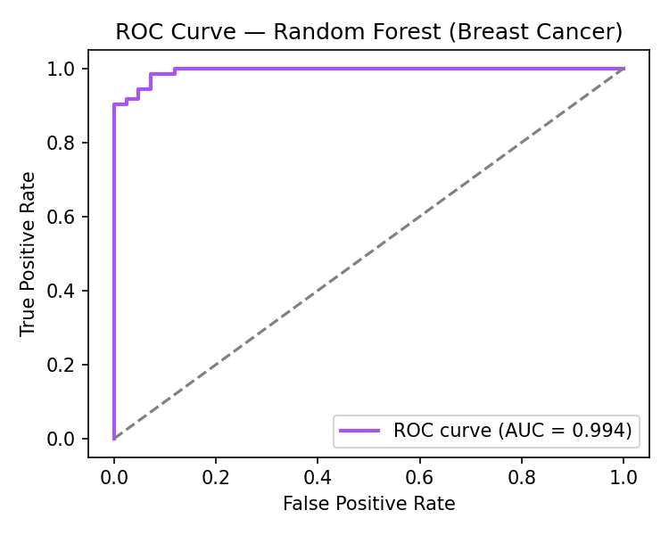
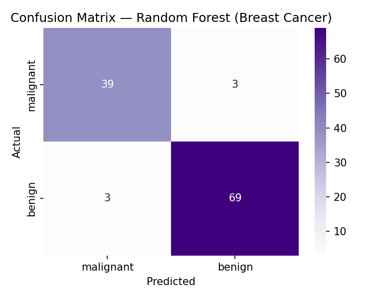
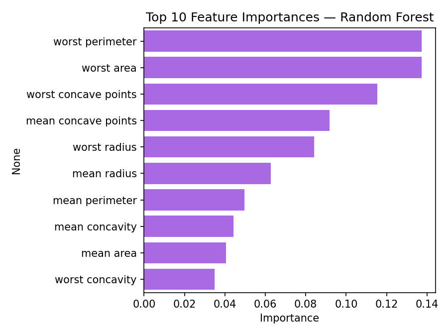
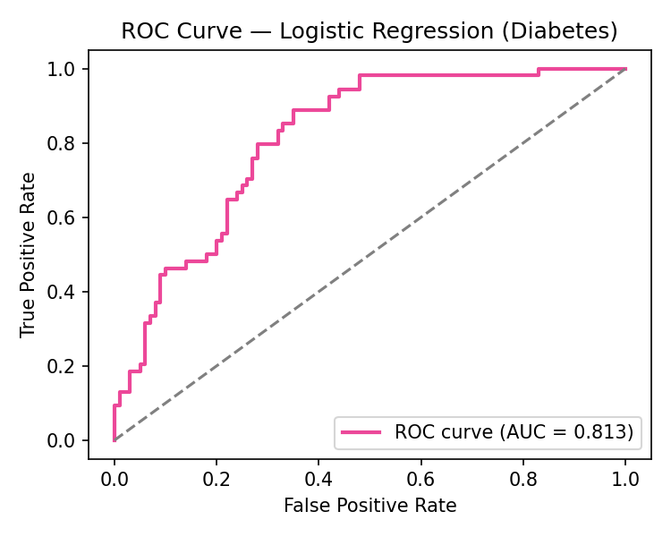
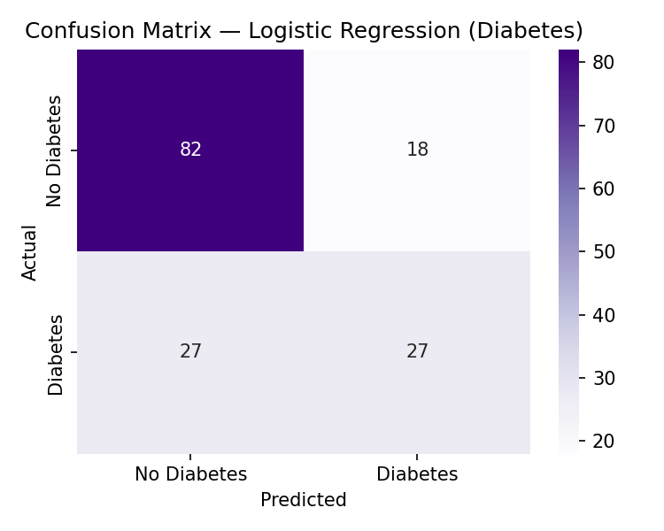
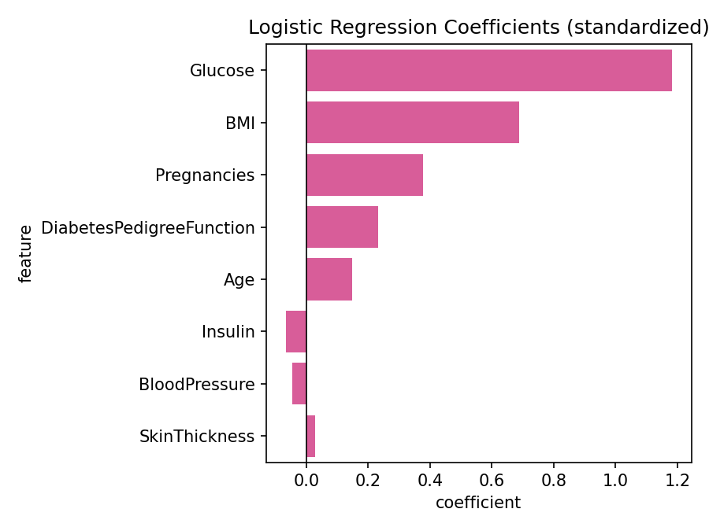
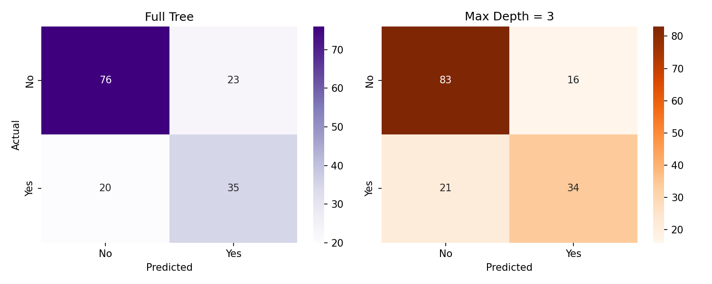
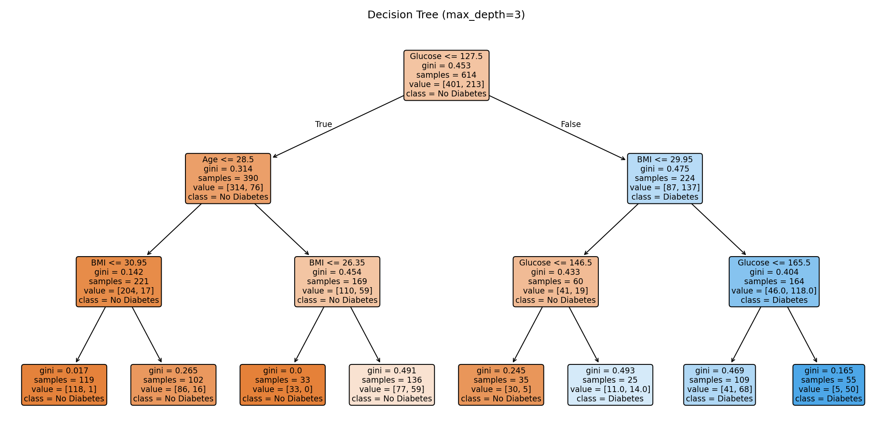
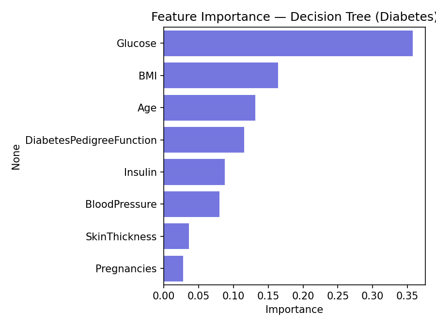

# Classification Models on Healthcare & Survival Data

Four end-to-end binary classification pipelines — data cleaning, feature
scaling, model training, evaluation, and interpretation — built with
scikit-learn and XGBoost.

| # | Task | Model | Dataset |
|---|------|-------|---------|
| 1 | Tumor diagnosis | Random Forest | Breast Cancer Wisconsin (sklearn built-in) |
| 2 | Diabetes prediction | Logistic Regression | Pima Indians Diabetes |
| 3 | Survival prediction | XGBoost | Titanic |
| 4 | Diabetes prediction | Decision Tree (full vs. depth-limited) | Pima Indians Diabetes |

Every script follows the same shape: load data → clean/scale → train →
evaluate (Accuracy, Confusion Matrix, Precision, Recall, F1, ROC-AUC where
applicable) → interpret (coefficients or feature importance).

## Results

### 1. Random Forest — Breast Cancer Diagnosis
Malignant vs. benign tumor classification on 30 diagnostic features.

| Accuracy | Precision | Recall | F1-score | ROC-AUC |
|---|---|---|---|---|
| 0.947 | 0.958 | 0.958 | 0.958 | 0.994 |

 



### 2. Logistic Regression — Diabetes Prediction
Zero-values in `Glucose`, `BloodPressure`, `SkinThickness`, `Insulin`, and
`BMI` were treated as missing (physiologically impossible) and imputed with
the column median before scaling.

| Accuracy | Precision | Recall | F1-score | ROC-AUC |
|---|---|---|---|---|
| 0.708 | 0.600 | 0.500 | 0.545 | 0.813 |

 

**Coefficient interpretation:** `Glucose` (+1.18) and `BMI` (+0.69) are the
strongest positive predictors of diabetes on the standardized scale —
consistent with the clinical picture — followed by `Pregnancies` and
`DiabetesPedigreeFunction`.



### 3. XGBoost — Titanic Survival Prediction
Engineered `FamilySize` from `SibSp` + `Parch`, encoded `Sex`/`Embarked`,
and trained with explicit hyperparameters (`n_estimators=300, max_depth=4,
learning_rate=0.05, subsample=0.8, colsample_bytree=0.8`).

> Requires `xgboost` and internet access to fetch the dataset at runtime —
> run `python src/03_titanic_xgboost.py` to generate results and plots.

### 4. Decision Tree — Diabetes Prediction (Full vs. Depth-Limited)
Same cleaning approach as Task 2, compared a fully-grown tree against one
capped at `max_depth=3`.

| Model | Accuracy | Precision | Recall | F1-score |
|---|---|---|---|---|
| Full Tree | 0.721 | 0.603 | 0.636 | 0.619 |
| Max Depth = 3 | **0.760** | **0.680** | 0.618 | **0.648** |

The depth-limited tree generalizes better on every metric except recall —
a clean example of how pruning reduces overfitting on a small, noisy
tabular dataset.







`Glucose` is by far the strongest predictor across both Task 2 and Task 4,
which is a good sanity check — two different model families agree on it.

## Project structure

```
.
├── README.md
├── requirements.txt
├── data/
│   └── pima-diabetes.csv        # Pima Indians Diabetes (768 rows)
├── src/
│   ├── 01_breast_cancer_random_forest.py
│   ├── 02_diabetes_logistic_regression.py
│   ├── 03_titanic_xgboost.py
│   └── 04_diabetes_decision_tree.py
├── outputs/                      # metrics (.json) + plots generated on run
└── assets/                       # plots embedded in this README
```

## Running it

```bash
pip install -r requirements.txt

python src/01_breast_cancer_random_forest.py   # no internet needed
python src/02_diabetes_logistic_regression.py  # uses data/pima-diabetes.csv
python src/03_titanic_xgboost.py               # fetches titanic.csv at runtime
python src/04_diabetes_decision_tree.py        # uses data/pima-diabetes.csv
```

Each script prints metrics to the console and saves plots + a metrics
`.json` to `outputs/`.

## Tech stack

Python · pandas · NumPy · scikit-learn · XGBoost · Matplotlib · Seaborn

## Notes on methodology

- **Zero-as-missing handling:** in the Pima dataset, a value of `0` in
  `Glucose`, `BloodPressure`, `SkinThickness`, `Insulin`, or `BMI` is not
  physiologically possible — those are treated as missing and imputed with
  the median rather than left as-is, which would otherwise bias the model.
- **Stratified splits** are used where class imbalance matters (Breast
  Cancer, Diabetes) to keep train/test class ratios representative.
- **Feature scaling** (`StandardScaler`) is applied before Logistic
  Regression and XGBoost, since both are sensitive to feature magnitude;
  it's skipped for the tree-based models, which are scale-invariant.
